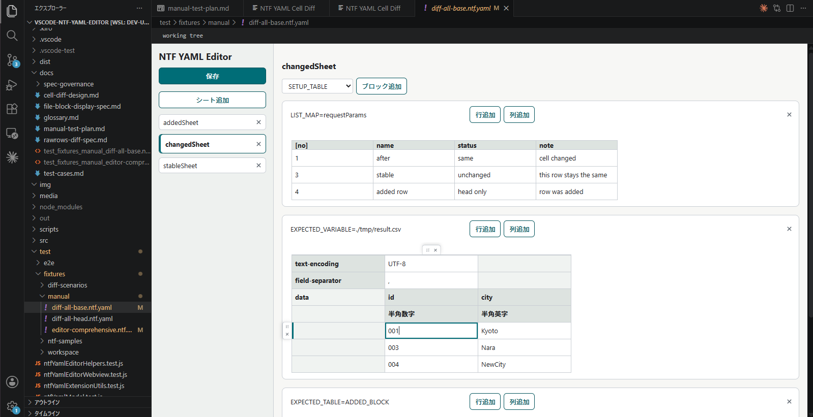
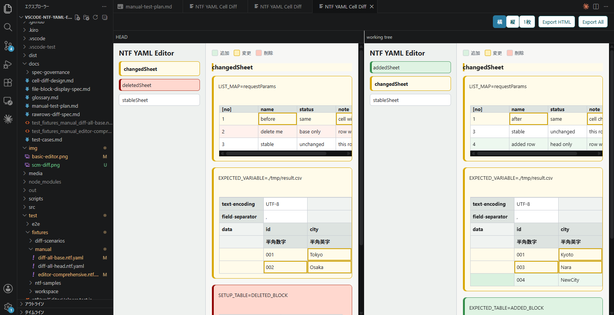
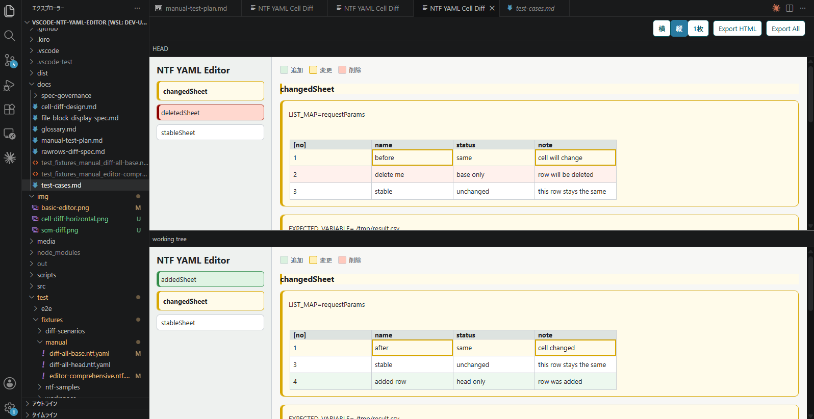
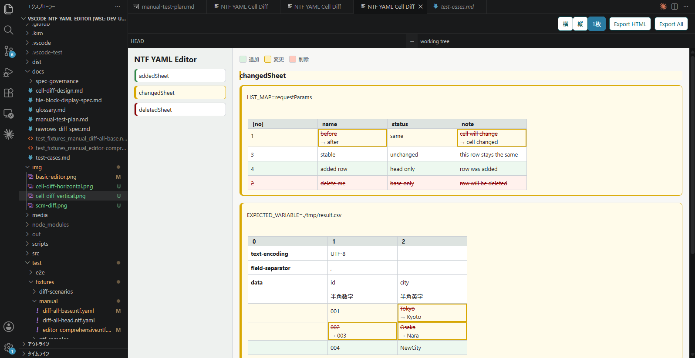

# readme

## これはなに

NTFでテストデータをyamlとして扱うことを支援する、javajavawhaleの個人プロジェクトです。

- yamlテストデータの閲覧・編集を支援するVSCode拡張：PoC実装済
- Excelテストデータをyaml化するマイグレーションスクリプト：未実装
- 静的解析等のCLIツールチェイン：未実装

yamlのフォーマットは、[nablarch公式のサンプルリポジトリをyaml化してみたもの](https://github.com/javajavawhale/nablarch-example-batch-ntf-yaml)に準じます。

## 導入方法

1. [GitHub Releases](https://github.com/javajavawhale/ntf-yaml-editor/releases) から最新の `.vsix` ファイルをダウンロード
2. コマンドパレット（`Ctrl+Shift+P`）→ `Extensions: Install from VSIX...` → ファイルを選択

以後、`.ntf.yaml` ファイルを開くと自動でエディタが起動します。

## 背景

[Nablarch Testing Framework](https://nablarch.github.io/docs/LATEST/doc/development_tools/testing_framework/index.html)では、テストデータをExcelファイルに記載しますが、AIコーディングエージェントが普及してきた昨今、AIフレンドリーなフォーマットへの移行の機運が高まっています。一方、表形式やコメントを人間フレンドリーに表現できるExcelフォーマットも捨てがたいです。

このVSCode拡張では、yamlのテストデータの閲覧・編集を支援する機能を提供することで、

- Excelのメリット：人間が直感的にテストデータを操作・確認できる
- yamlのメリット：AIコーディングエージェントが扱いやすい

の両立を目指します。

## 機能概要

### yamlテストデータエディタ

#### 通常エディタ

拡張機能をインストールした状態で、VSCodeのエクスプローラから\*.ntf.yamlを開くとyamlテストデータエディタが立ち上がります。

各種データの追加・削除・編集ができます。



- 値の編集：セルをクリック
- 行/列の並び替え：セルのホバーで表示されるハンドルアイコンをドラッグ&ドロップ
- 行/列の削除：セルのホバーで表示されるゴミ箱アイコンのクリック

#### 任意のリビジョン間でのファイルの差分表示

エクスプローラでyamlファイルを右クリック>（NTF YAML Editor: NTF データ差分を表示）をクリックすると、任意のリビジョンの差分を表示できます。
デフォルトではカレントブランチのHEADとworking treeの差分が出ます。



ビューは、横・縦・1枚の3種類あります。




#### 差分のHTMLレポート出力

差分表示ビューの上部の Export HTML ボタンで、差分をhtml出力できます。Export All ボタンでは、差分のあるすべての*.ntf.yamlをhtml出力します。

レポートの機能は「#### 任意のリビジョン間でのファイルの差分表示」とほぼ同一です。レビュー時に共有する用途での利用を想定しています。

#### gitのソース管理上からファイルの差分表示

gitのソース管理でyamlをクリックすると、HEADとworking treeの差分が表示されます。機能は「#### 任意のリビジョン間でのファイルの差分表示」とほぼ同一です。
ただし、技術的制約により表示フォーマットは横並びのみです。

#### 補足

1. 
一般の\*.yamlは標準のテキストエディタで開きます。一般の\*.yamlでもこのエディタを使いたい場合は、ファイルを右クリックし、`Reopen Editor With...` から `NTF YAML Table Editor (Generic YAML)` を選択してください。
常に\*.yamlでこのエディタを使いたい場合は、settings.json に次の設定を追加できます。

```json
{
  "workbench.editorAssociations": {
    "*.yaml": "ntfYaml.editor.generic"
  }
}
```

2. 未対応事項

- 拡大縮小機能がない
- コメント機能対応
- 通常エディタのハンドルアイコンをホバーするときのマウスアイコンがおかしい。拡大縮小のアイコンになっている
- カードのドラッグ可能領域が変。あとカーソルが消滅する
- ファイル用テーブルで、セルをホバー時に列がハイライトされない（辺が緑色にならない）
- ブロック名のinput要素とテーブルに、余計な余白がある

## License

This project is licensed under the MIT License. See [LICENSE.txt](LICENSE.txt).
