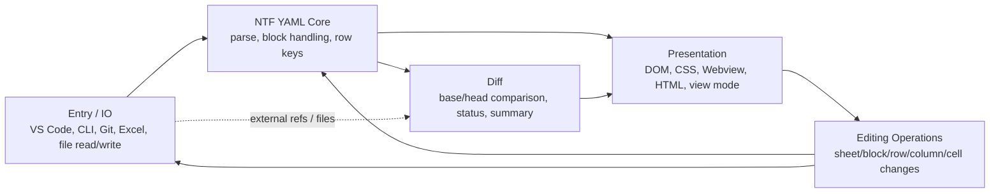

# 方式設計ドラフト

作成日: 2026-05-17

この文書は仕様棚卸しの結果を、リファクタリングの入力として読める方式設計に整理する。
前半は ASIS の現状分析、後半は TOBE の設計案である。
既存ファイル名ではなく、NTF YAML Editor の処理フローから責務を切り出す。

レビューでは、ASIS は事実認識が合っているか、TOBE はこの分け方でリファクタの入力になるかを確認する。
確定、要確認、却下などの判断状態は `open-decisions.md` で管理し、この文書では重複管理しない。

## ASIS: 現状分析

## 用語

| 用語 | 意味 | この文書での扱い |
| --- | --- | --- |
| 生 YAML | ファイルに保存されている文字列そのもの。コメント、空行、クォート、並び、インデントなどの表記を含む。 | 実際に NTF が読む入力であり、最終的な保存対象。 |
| model | `parseYaml()` が生 YAML から作る `{ sheets: [...] }` の JavaScript オブジェクト。sheet / block / row / cell として UI や diff が扱いやすい形。 | 表示、編集操作、差分のための内部表現。生 YAML の全情報を常に保持するとは限らない。 |
| block の扱い | block を通常 table、ファイル系 table、fallback 表示のどの経路に通すかの判断。 | 生 YAML の独立要素ではなく、エディタの振る舞いを決めるレビュー観点として扱う。 |

今回の方式設計では、生 YAML から model へどう解釈するか、model をどう編集・表示・diff するかを扱う。
model から生 YAML へ戻す serializer と、CLI lint 用の validation は、この文書の責務分解対象にしない。
NTF YAML Analysis は今回のビュー系フローから呼び出さない。

## 仕様根拠一覧

| 根拠 | 現状 | 使い方 |
| --- | --- | --- |
| Nablarch example 由来 `.ntf.yaml` | `/home/happy/nablarch/samples/nablarch-example-*` に存在 | 実行可能 YAML の経験的根拠として優先する。 |
| repo 内 fixture | `test/fixtures/ntf-samples/` | 仕様根拠としては信頼しない。最終的に example からコピーし直すか、example との一致を再検証する。 |
| converter output | `tools/xlsx_to_ntf_yaml.py`, `tools/xls_to_ntf_yaml.py` | Excel から YAML へ移行する正規出力候補。現時点では通常 table とファイル系 table の PoC 出力。 |
| 既存 docs | `docs/cell-diff-design.md`, `docs/file-block-display-spec.md`, `docs/rawrows-diff-spec.md` | レビュー済み/未レビューが混在するため、`open-decisions.md` で矛盾解消の判断を記録する。 |
| NTF 仕様 | 未紐付け | example と converter だけで確定できない挙動の確認先。対象箇所ごとに参照を追記する。 |

確認済み example ブロック:

- `LIST_MAP`
- `SETUP_TABLE`
- `EXPECTED_TABLE`
- `SETUP_VARIABLE`
- `EXPECTED_VARIABLE`

ユーザー確認済みの NTF ドメイン知識:

- `SETUP_FIXED` / `EXPECTED_FIXED` は、ディレクティブ行以外の仕様を `SETUP_VARIABLE` / `EXPECTED_VARIABLE` と同じファイル系表として扱う。
- この判断は、ユーザー確認済みの NTF ドメイン知識を根拠にする。

## ビュー別の振る舞い

| ビュー | 入力 | 表示 | 編集 | 保存 | diff |
| --- | --- | --- | --- | --- | --- |
| Normal Editor | Explorer などで開いた `file://` の `.ntf.yaml` | `renderHtml` が単一 Webview を構築 | readOnly でない場合はセル、行、列、ブロック、シート操作を許可 | Webview から `save` message を送り、`extension.js` が文書全体を置換 | 通常はなし。SCM Diff の head 側では差分情報を重ねる場合がある。 |
| SCM Diff | VS Code diff editor が `git://` と `file://` を左右別々に開く | 各ペインで `renderHtml` を呼ぶ | base は readOnly。head 側は作業ツリーファイルとして編集可能 | head 側の Webview から `save` message を送り、`extension.js` が文書全体を置換 | `createEditorDiffReport` が Git/working tree から diff report を作り、各ペインに渡す。 |
| Cell Diff | `ntfYaml.openCellDiff` の対象 URI | `renderHtmlDiffPanel` が 1 Webview 内に左右/縦/1枚表示を構築 | readOnly | 保存しない | `createRefDiffReport` または `createDocumentDiffReport` の結果を表示する。 |
| HTML Report | CLI / Export HTML / Export All の出力 | `renderStandaloneHtmlDiffPanel` による静的 HTML | readOnly | 保存しない | 生成時点の diff report を埋め込む。 |

共有すべきもの:

- sheet / block / row / cell の意味
- block の扱い判定
- diff の同一性と表示状態
- 構造セルの意味
- readonly の基本方針

ビュー固有に残すもの:

- VS Code URI、Git ref、Webview panel、保存イベント
- Cell Diff の ref 入力、Export HTML、Export All
- HTML Report の静的出力制約
- SCM Diff の左右ペイン管理

## ブロックの扱い棚卸し

この表は、block をどの表示・編集・diff 経路に通すかを洗い出す。
判断状態はここでは管理しない。

| 扱い | ブロック | 根拠 | ビュー上の扱い |
| --- | --- | --- | --- |
| Table Block | ファイル系 block 以外の NTF block | ユーザー確認済み NTF ドメイン知識、example / converter | 通常の object row の表として表示・編集・diff する。個別 prefix ごとの表示区分は作らない。 |
| File Rows Block | `SETUP_VARIABLE` | example | row 配列のファイル系表として表示・編集・diff する。 |
| File Rows Block | `EXPECTED_VARIABLE` | example | row 配列のファイル系表として表示・編集・diff する。 |
| File Rows Block | `SETUP_FIXED` | ユーザー確認済み NTF ドメイン知識 | 可変長ファイルと同じファイル系表として表示・編集・diff する。 |
| File Rows Block | `EXPECTED_FIXED` | ユーザー確認済み NTF ドメイン知識 | 可変長ファイルと同じファイル系表として表示・編集・diff する。 |
| Raw Block | 表として扱えない YAML 形状 | 実装上の fallback | NTF block 種別ではなく、通常表示できない形状を壊さず表示するための fallback として扱う。 |

## 責務一覧

| 責務 | 入力 | 出力 | 現行コード | レビュー観点 |
| --- | --- | --- | --- | --- |
| 入力取得 | VS Code document、Git ref、Excel file、CLI args | YAML text または workbook rows | `extension.js`, `lib/ntfYamlGitDiffContext.js`, `bin/ntf-yaml.js`, `tools/*.py` | URI/Git/Excel の都合を NTF YAML 解釈へ漏らさない。 |
| NTF YAML 解釈 | YAML text | `{ sheets: [...] }` model | `lib/ntfYamlModel.js` | NTF block の扱いと YAML 形状の判断根拠を明示する。 |
| NTF 検査 | model または YAML text | diagnostics | `analyzeYaml()` in `lib/ntfYamlModel.js`, `lib/ntfYamlDiagnostics.js` | 今回のビュー系フローでは呼び出さない。CLI lint の既存機能として扱い、拡充対象にしない。 |
| 編集操作 | model + user action | updated model | `media/ntfYamlEditorWebview.js`, `media/ntfYamlEditorHelpers.js` | 保存できる操作と表示専用操作を分ける。 |
| 保存 | model | YAML text | `serializeYaml()` in `lib/ntfYamlModel.js`, `extension.js`, `bin/ntf-yaml.js` | 今回の責務分解対象外。編集結果を保存する既存経路として参照する。 |
| 差分 | base/head YAML text | diff report | `lib/ntfYamlDiff.js`, `lib/ntfYamlGitDiffContext.js` | 同一性ルール、行順、構造セル、fallback 表示の扱いを根拠に紐付ける。 |
| 表示 | model/diff report | Webview/HTML DOM | `lib/ntfYamlWebviewHtml.js`, `media/ntfYamlEditorWebview.js`, `media/ntfYamlEditor.css` | ビュー共通の意味とビュー固有 UI を分ける。 |
| 外部入口 | VS Code commands、custom editor、CLI | ユーザー操作の開始点 | `extension.js`, `package.json`, `bin/ntf-yaml.js` | entrypoint の制約をモデルや diff の意味へ混ぜない。 |

## 既存コード対応

| ファイル | 主な責務 | 公開 API / 入口 | 現状リスク |
| --- | --- | --- | --- |
| `extension.js` | VS Code 連携、custom editor、commands、Cell Diff panel | `activate()` | VS Code 入口、Git diff 文脈、保存処理、HTML panel が集中している。NTF YAML Analysis はビュー系フローから呼び出さない。 |
| `lib/ntfYamlModel.js` | parse / serialize / diagnostics / block の扱い判定 | `parseYaml`, `serializeYaml`, `analyzeYaml`, block 判定関数 | YAML 解釈、保存、診断、block の扱い判定が同居しており、仕様確認前の block 判定変更が広く波及する。 |
| `lib/ntfYamlDiff.js` | model diff、Git ref diff、summary HTML | `createDiffReport`, `diffGitRefs`, `writeSummaryHtmlReport` | diff 意味と出力生成が近い。Fixed-length は `open-decisions.md` の判断を反映する。 |
| `lib/ntfYamlGitDiffContext.js` | VS Code/Git/working tree/index の diff context | `createDocumentDiffReport`, `createRefDiffReport`, `diffWorkingTreeAllFiles` | Git/URI 解決と diff report 作成が結合している。 |
| `lib/ntfYamlWebviewHtml.js` | Webview/HTML の HTML 組み立て | `renderHtml`, `renderHtmlDiffPanel`, `renderStandaloneHtmlDiffPanel` | script/css 埋め込みと view composition が同居している。 |
| `media/ntfYamlEditorWebview.js` | DOM rendering、編集操作、unified diff rendering | `createNtfYamlEditorApp` | 表示、操作、diff 表示、model 変換補助が大きくまとまっている。 |
| `media/ntfYamlEditorHelpers.js` | UI helper、ファイル系 table 表示補助 | global helper | 構造セル判定が表示仕様の中へ埋まりやすい。 |
| `media/ntfYamlEditorDiffHelpers.js` | diff 表示補助 | global helper | diff 意味と CSS 表示の境界確認が必要。 |
| `bin/ntf-yaml.js` | CLI lint/format/convert/diff | `main`, command functions | format が `serializeYaml(parseYaml())` に直結しており、保存仕様変更の影響を受ける。 |
| `tools/xlsx_to_ntf_yaml.py` | `.xlsx` converter | CLI script | 通常 table とファイル系 table を出す PoC。converter output を確定仕様にするには範囲確認が必要。 |
| `tools/xls_to_ntf_yaml.py` | `.xls` converter | CLI script | `.xlsx` と同等の PoC 出力。 |

## TOBE: 最小責務分解案

この案はファイル分割の指示ではない。
まずレビュー可能な責務境界を決め、実際の分割は必要になった箇所だけ行う。

| 責務 | 担当すること | 現時点の分割判断 | 理由 |
| --- | --- | --- | --- |
| Entry / IO | VS Code、CLI、Git、Excel converter との接続。文書読み書き、Webview message、Git ref 解決。 | 既存の `extension.js`, `bin/`, `tools/`, `lib/ntfYamlGitDiffContext.js` を基本維持 | 外部 API 依存を閉じ込める価値がある。 |
| NTF YAML Core | parse、block の扱い判定、Table Block の row key 解釈。 | まずは `lib/ntfYamlModel.js` 内で責務を整理し、必要になった関数だけ分離 | 生 YAML を model としてどう解釈するかを集約する。 |
| Editing Operations | sheet/block/row/column/cell の追加、削除、リネーム、並び替え、値変更。 | Webview 内の操作を、可能なら Core の純粋関数へ移す | 編集は UI だけの責務ではない。保存可能なモデル変更として定義する必要がある。 |
| Diff | base/head model から diff report を作る。同一性ルール、行/列/セル status、summary。 | `lib/ntfYamlDiff.js` を維持し、HTML 生成や Git 取得との混在を減らす | Diff の意味論は保存や表示から独立してテストしたい。 |
| Presentation | DOM 構築、CSS、Webview/HTML の組み立て、readonly/view mode の適用。 | `media/` と `lib/ntfYamlWebviewHtml.js` を基本維持。View Model は独立層にしない | View Model を先に作ると過剰。構造セルや readonly 判定が複雑化した時だけ helper として切り出す。 |
Serializer と Validation は今回の責務分解対象にしない。
既存の `serializeYaml()` と `analyzeYaml()` は存在するが、この方式設計では新しい層として切り出さない。
`analyzeYaml()` は CLI lint の既存機能として残し、Normal Editor、SCM Diff、Cell Diff、HTML Report の処理フローでは呼び出さない。

責務の関係:

この図の矢印は、実装上の import 依存ではなく、主要なデータ受け渡しを表す。
矢印の元はデータやイベントを渡す責務、矢印の先はそれを受け取って次の判断や変換を行う責務である。
点線は、通常の画面操作ではなく、Git ref やファイル内容など外部入力を使う補助的な受け渡しを表す。



読み方:

- `Entry / IO` は外部との入出力だけを扱い、NTF YAML の意味を決めない。
- `NTF YAML Core` は生 YAML を model として解釈する。
- `Presentation` は表示と UI イベントを扱う。
- `Editing Operations` は UI イベントを model 変更として定義する。
- `Diff` は base/head の違いを計算し、編集は担当しない。

Domain Model を独立層として先に作らない理由:

- 今回の根本課題は、独立した model 層の不足ではなく、block の扱い、ビューごとの編集可否、保存・diff の判断根拠が曖昧なことである。
- 先に Domain Model 層を作ると、未確定の判断を新しい層の API として固定しやすい。
- `parseYaml()` の戻り値である `{ sheets: [...] }` は、現時点で表示・編集・diff の入力として機能している。
- まずは Core 内で、どの block を通常 table / file rows / fallback 表示として扱うかを明確にする。
- その後、同じ model 操作が複数箇所に重複した場合だけ、関数単位で切り出す。

つまり、Domain Model 層を後で作る前提として置くのではない。
必要性が出た場合に、別の設計判断として追加を検討する。

分離を検討する条件:

- 編集操作が複雑化し、Webview から独立して model 操作をテストしたくなったとき。
- 生 YAML の解釈に必要な情報と、UI 表示に必要な情報が明確に分かれたとき。
- CLI lint の拡充を別作業として扱うことが決まったとき。

Diff と Presentation は分ける。
Diff は「何が変わったか」を決める責務で、Presentation は「どう見せるか」を決める責務である。
ただし View Model という独立層は今は作らず、表示補助 helper の範囲に留める。

Editing Operations は Core と Presentation の間にまたがる。
UI イベントの受け取りは Presentation、モデルをどう変更するかは Editing Operations として Core 側へ寄せる。

## TOBE: 処理の流れ

この節は、機能ごとにどの責務を通るかを示す。
実装順序やファイル分割の指示ではない。
serializer と validation の設計は今回の対象外なので、保存や lint の内部詳細は展開しない。
ビュー系フローは NTF YAML Analysis を通らない。

Normal Editor:

```text
Entry / IO
  -> NTF YAML Core
  -> Presentation
  -> user edit in Presentation
  -> Editing Operations
  -> Entry / IO
```

SCM Diff:

```text
Entry / IO
  -> NTF YAML Core
  -> Diff
  -> Presentation
  -> head side user edit in Presentation
  -> Editing Operations
  -> Entry / IO
```

Cell Diff / HTML Report:

```text
Entry / IO
  -> NTF YAML Core
  -> Diff
  -> Presentation
```

レビュー観点:

- 各フローが `TOBE: 最小責務分解案` の責務名だけで説明できるか。
- Normal Editor と SCM Diff head は、どちらも保存に到達する編集フローである。
- SCM Diff base、Cell Diff、HTML Report は、保存に到達しないレビュー専用フローである。
- Diff は保存前後の YAML を比較する責務であり、編集操作そのものは担当しない。
- Presentation は UI イベントを受けるが、model の変更ルールは Editing Operations に寄せる。
- Entry / IO は読み書きと外部 API 接続だけを扱い、NTF YAML の意味を決めない。
- serializer と validation は今回の対象外であり、ビュー系フローから validation を呼び出さない。

## 責務レビュー結果

| 観点 | 現状 | リファクタ入力 |
| --- | --- | --- |
| 仕様根拠の埋没 | `ntfYamlModel.js` の prefix 判定が仕様判断を内包している | block の扱いごとに根拠を docs に紐付け、判断状態は `open-decisions.md` で管理する。 |
| 対象外責務との混在 | parse/diagnostics/serialize が同じ module にある | serializer と validation は今回の責務分解対象にしない。ビュー系フローから diagnostics を呼び出さない。 |
| UI 都合の混入 | Webview が block rename 時に row 変換を行う | UI 操作を domain operation と view operation に分ける。 |
| view 差の重複 | Normal/SCM/Cell/HTML が同じ Webview app を使うが、readonly と diff 文脈が散らばる | view mode と readonly 判定を表示補助 helper に寄せる。独立した View Model 層は作らない。 |
| fixed-length | 可変長ファイルと同じファイル系表として表示/edit/save/diff する。 | 現行実装は readonly と固定長編集を保存できない挙動になっているため修正する。固定長専用モデル化は採用しない。 |
| generated output | HTML 出力が tracked file として残っている | 生成物を仕様根拠にしない。必要なら生成手順に紐付ける。 |

## テスト境界

| 対象 | 主な test | 分類 |
| --- | --- | --- |
| Parser/Core | `test/ntfYamlModel.test.js` | 仕様テスト + characterization が混在 |
| Diff Engine/Git context/CLI | `test/ntfYamlModel.test.js` | 仕様テスト + integration 寄り |
| Webview DOM 操作 | `test/ntfYamlEditorWebview.test.js` | UI behavior / regression |
| Utility | `test/ntfYamlExtensionUtils.test.js` | unit |
| VS Code extension host | `test/e2e/suite/` | e2e |
| Manual fixtures | `test/fixtures/manual/` | 手動確認 |
| NTF samples | `test/fixtures/ntf-samples/` | 再検証対象。example からコピーし直すか一致を確認するまで仕様根拠にしない。 |
| Diff scenarios | `test/fixtures/diff-scenarios/` | diff review scenario |

各テストの分類は `test-inventory.md` に軽量フォーマットで記録する。

## 判断管理

この方式設計から出た判断待ちは、`open-decisions.md` または `test-inventory.md` で扱う。
この文書には、リファクタリング時に参照する責務境界とデータの流れだけを残す。
